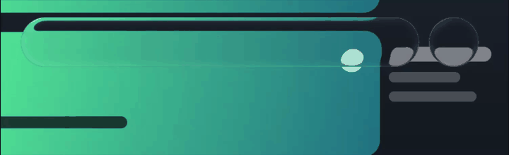

# apple-liquid-glass-webgl

Framework-free WebGL2 liquid glass. Two renderers, one element contract:

- **V1** `LiquidGlassWebGL` — the frosted original: bevel height field, variable blur, smooth-union fusion.
- **V2** `LiquidGlassWebGLV2` — the clear optical model: edge capture, pre-blurred refraction, pressed lens.

Shapes: `folder`, `rect`, `pill`, `circle`. Coordinates are CSS pixels. Backdrops are images, canvases, videos, `ImageBitmap` or `OffscreenCanvas`.

<table align="center" width="100%">
  <tr>
    <td align="center" width="50%">
      
    </td>
    <td align="center" width="50%">
      
    </td>
  </tr>
</table>

<p align="center">
  
</p>

<p align="center">
  
</p>

Playground: [oliverrr2424.github.io/webgl-apple-liquid-glass](https://oliverrr2424.github.io/webgl-apple-liquid-glass/)

## Install

```bash
npm install apple-liquid-glass-webgl
```

WebGL2 required. Give the canvas a CSS size before rendering. Feature-detect instead of catching the constructor:

```js
if (!LiquidGlassWebGL.isSupported()) panel.classList.add('css-fallback');
```

## Quick start

```js
import { LiquidGlassWebGLV2, getDefaultMaterialV2 } from 'apple-liquid-glass-webgl/v2';

const glass = new LiquidGlassWebGLV2(document.querySelector('canvas'), {
  material: getDefaultMaterialV2(),
  compositeMode: 'overlay',          // transparent outside the glass
});

await glass.loadBackdrop('/images/wallpaper.jpg');
glass.setElements([
  { id: 'bar',  shape: 'pill', x: 100, y: 28, width: 560, height: 66 },
  { id: 'card', shape: 'rect', x: 18, y: 120, width: 357, height: 78, tint: 0.86, tintTone: 'light' },
]);
glass.render();
```

V1 is the same API with a different material and `fusion`:

```js
import { LiquidGlassWebGL } from 'apple-liquid-glass-webgl';
const v1 = new LiquidGlassWebGL(canvas, { material: 'regular', fusion: true });
```

Both classes can run at once. Materials are not interchangeable: V2 throws on V1 preset names and on unknown keys rather than applying a value in the wrong unit.

## Elements

```ts
{ id, shape, x, y, width, height | size,
  radius?,                     // explicit CSS-px corner (V2), else roundness ratio
  tint?, tintTone?,            // V2: per-surface tint opacity, 'light' | 'dark' | 'auto'
  frost?, opacity?,            // V2: per-surface softness ratio / fade
  pressure?, pressureAxes? }   // V2: pressed lens 0..1, per-axis squash weights [x, y]
```

`pressure` squashes what is seen through the glass while a control is held. `pressureAxes` (default `[1, 1]`) weights that squash per axis, so a capsule can flatten without shortening. Overlapping V2 surfaces resolve in element order; V1 `fusion` / `mergeRadius` do not apply to V2.

## V2 material

`getDefaultMaterialV2()` returns a fresh copy. Ratios are relative to the component short side, so one material scales from a 40 px toggle to a 400 px card.

| Group | Key | Default | Meaning |
| --- | --- | ---: | --- |
| Transmission | `refraction` | `84` | Body bending strength (0–110) |
| | `edgeReach` | `0.17` | Capture distance / short side. `0` disables capture |
| | `edgeWidth` | `0.11` | Capture band width / short half-side |
| | `dispersion` | `2.0` | RGB sample split, display px |
| | `frost` | `0` | Pre-blur radius / short side (softness ratio) |
| | `backdropBlur` | `0` | Pre-blur radius, CSS px. Combines with `frost` in quadrature |
| | `body` | `0.72` | Glass body density |
| | `absorption` | `0.58` | Path absorption |
| | `tint` | `0` | Tint opacity (element `tint` overrides) |
| Reflection | `rim` | `0.24` | Edge light |
| | `reflection` | `0.31` | Backdrop reflection |
| | `highlight` | `0.34` | Specular highlight |
| | `lightAngle` | `136` | Fallback light direction, degrees |
| | `echo` | `0.28` | Inner echo |
| Interface | `hairline` | `0.92` | Contour line strength |
| | `hairWidth` | `0.52` | Contour line width |
| | `roundness` | `0.47` | Corner radius / short half-side |

`frost` and `backdropBlur` are the same operation — the backdrop is blurred *before* the lens bends it — differing only in units. Old pixel-based `edgeReach` values divide by the intended component short side.

Live backdrops: transmission updates every frame; the light probe is rate-limited (~84 ms), read back on a Worker so frames never wait on the GPU, and the detected light direction eases over ~280 ms.

## Ready-made navbar and switch

The package includes framework-free controls that create their own canvas layers, pointer/keyboard interaction, spring animation and accessibility state. Give each control a container and a backdrop image, canvas or video:

```js
import {
  LiquidGlassNavbar,
  LiquidGlassSwitch,
} from 'apple-liquid-glass-webgl/controls';

const navbar = new LiquidGlassNavbar(document.querySelector('#navbar'), {
  backdrop: '/wallpaper.jpg',
  items: [
    { value: 'gallery', label: 'Gallery', icon: '▣' },
    { value: 'featured', label: 'Featured', icon: '▰' },
  ],
  value: 'gallery',
  onChange: (value) => console.log(value),
});

const toggle = new LiquidGlassSwitch(document.querySelector('#toggle'), {
  backdrop: '/wallpaper.jpg',
  checked: false,
  onChange: (checked) => console.log(checked),
});

await Promise.all([navbar.ready, toggle.ready]);

// Controlled updates and cleanup:
navbar.setValue('featured');
toggle.setChecked(true);
navbar.destroy();
toggle.destroy();
```

The navbar defaults to the compact `312 × 96` short-pill geometry. Set `width` / `height` to change it. Resting material can be customized with `material`; pressed transmission remains on the tuned control recipe while reflection and interface values inherit from that material.

A complete dependency-installed Vanilla example is in [`examples/controls-quickstart`](examples/controls-quickstart): run `npm install && npm start` inside that directory.

## V1 material

`getDefaultMaterial()` / `makeMaterial('regular' | 'clear' | 'lens')`. Lengths are CSS pixels; `sizeAdaptation` (default `1`) fits them to small controls — the rim caps at 30 % of the short side and height, blur and highlights follow.

| Group | Keys (default) |
| --- | --- |
| Shape | `radius` 64, `squircle` 2, `mergeRadius` 52, `bevel` 34, `height` 21, `sizeAdaptation` 1 |
| Optics | `ior` 2, `dispersion` 0.06, `refractScale` 3, `meniscus` 1, `blurPlateau` 4.5, `blurRim` 11, `opticalDensity` 0.4 |
| Lighting | `specular` 0.89, `specPower` 29.5, `highlightAdapt` 0.91, `highlightWidth` 0.87, `highlightSharpness` 0.55, `highlightBase` 0.3, `fresnel` 0.65, `saturation` 1.35, `brightness` 0, `tintAmount` 0.02, `tintAdapt` 0.14 |
| Edge | `shadow` 0.09, `shadowSize` 4, `shadowOffset` 0, `lightX` -0.18, `lightY` 0.08, `edgeLine` 0.3, `edgeWidth` 0.5, `edgeDark` 0.02 |

Plus `tintColor: [1, 1, 1]` and `debug: 0` (1 thickness, 2 normals, 3 dispersion). The backdrop is stored in `SRGB8_ALPHA8` and filtered in linear light; output is dithered sub-LSB.

## Backdrops

```js
await glass.loadBackdrop('/img.jpg');                 // static, uploads once
glass.setBackdrop(canvasOrVideo);                     // live source: auto-detected, loop starts
glass.setBackdrop(src, { update: 'static', autoStart: false });
glass.updateBackdrop();                               // re-upload a static source you drew into
glass.start(); glass.stop();
```

`compositeMode: 'replace'` (default) paints the backdrop across the canvas; `'overlay'` leaves everything outside the glass transparent. Browsers do not expose composited DOM pixels to WebGL — supply the backdrop yourself. Cross-origin sources need CORS. Live uploads use `RGBA8` with sRGB decoded in-shader, which keeps Chrome/ANGLE on the GPU-to-GPU path on Windows.

## Rendering

```js
glass.render();                 // no-op when nothing changed
glass.render({ force: true });  // always draws (for readPixels)
glass.markDirty();              // after mutating glass.material in place
glass.markBackdropDirty();      // after drawing into a static backdrop source
```

Every mutator marks the surface dirty; the backdrop mip chain has its own flag, so moving a shape redraws only the glass pass. Live backdrops always redraw. `autoResize` (on) redraws on canvas resize. Pass `preserveDrawingBuffer: true` if you read the canvas back after composite.

The shader carries 16 shapes per pass; distant clusters are split into passes automatically (V1 warns when a single fused cluster exceeds 16).

## Hit testing

Evaluates the same SDF as the shader — a circle's corners miss, a fused bridge hits.

```js
const el = glass.hitTestEvent(event);           // element | null
const { x, y } = glass.pointerPosition(event);  // canvas CSS px
glass.hitTest(x, y, { tolerance: 8 });
glass.distanceAt(x, y);                         // signed, negative inside
```

## Context loss & accessibility

Context loss is handled: the canvas keeps its last frame, calls become no-ops, and programs/textures are rebuilt on restore (`onContextLost`, `onContextRestored`, `glass.contextLost`).

`prefers-reduced-transparency: reduce` swaps in a near-opaque material (no refraction, dispersion or scattering; shape, edge and shadow remain). Opt out with `respectReducedTransparency: false`; `glass.effectiveMaterial` is what is actually in use.

## API

```js
LiquidGlassWebGL.isSupported()
glass.setMaterial('clear' | { blurPlateau: 4 })
glass.setElements(list, shouldRender = true)
glass.addElement(el) / updateElement(id, patch) / removeElement(id)
glass.setFusion(true, 52)          // V1 only
glass.resize() / destroy()
```

Exports: `SHAPES`, `COMPOSITE_MODES`, `BACKDROP_UPDATES`, `DEFAULT_MATERIAL`, `getDefaultMaterial`, `makeMaterial`, geometry helpers `sdGroup`, `hitTestElements`, `connectedElementGroups`, `groupElements`.
From `/v2`: `DEFAULT_MATERIAL_V2`, `getDefaultMaterialV2`, `makeMaterialV2`, `distanceToElementsV2`, `hitTestElementsV2`.

## Playground

```bash
npm install && npm run serve      # http://localhost:8765
```

Four scenes (Press, iPhone Home, live Scroll feed, wallpaper gallery), V1/V2 switch with independent materials, every parameter as slider + typed value (double-click a label to reset it), light/dark glass, navigation-lens geometry for the Press selector, image/video backdrop upload, fps / CPU / buffer readout. **Copy link** serialises the session into the URL; **Copy code** emits the reproducing snippet.

## Development

```bash
npm test                     # unit (node --test) + browser pages (Playwright)
npm run test:visual          # SwiftShader golden comparison; --update to re-record
npm run shot out.png -- --scene 0 --size 1200x720 --no-panel
npm run pack:check
```

`tests/*.test.mjs` cover geometry, material and permalink rules. `tests/*.html` each export `window.runTest()` and cover live/static backdrops, context loss, dirty tracking (draw-call counts), V2 optics and light probing. Baselines live in `shots/baseline/<renderer>/`.

Pushes to `main` run [`ci.yml`](.github/workflows/ci.yml), then [`publish-npm.yml`](.github/workflows/publish-npm.yml) publishes with provenance when `package.json` is ahead of npm (needs the `NPM_TOKEN` secret).

## License

MIT
